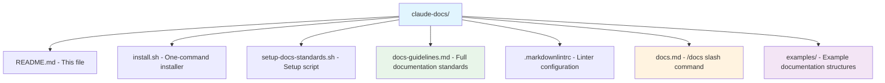
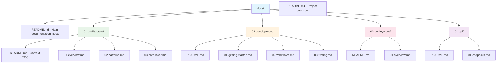
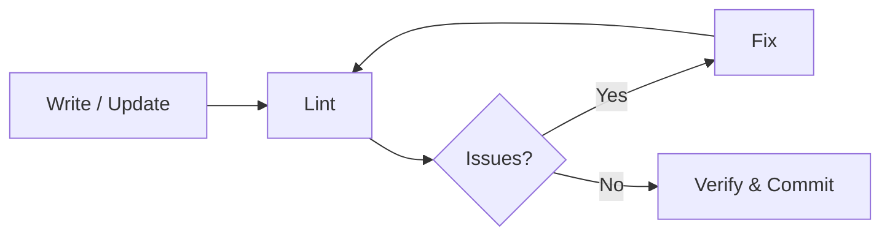

# Claude Code Documentation Standards

Global documentation standards and tooling for Claude Code projects. This package provides a standardized structure, linting, and automation for creating consistent, high-quality documentation.

## Features

- **Numbered Folder Structure** - Context-based organization with priority numbering
- **Automated Linting** - Built-in markdown linting with markdownlint
- **Slash Commands** - `/docs` command for easy documentation management
- **Progressive Detail** - Information architecture from overview to specifics
- **Quality Assurance** - Automated validation and formatting checks
- **CI/CD Ready** - Integration examples for GitHub Actions
- **Project Auto-Detection** - Automatically suggests structure based on project type
- **Health Reports** - Quantitative documentation quality assessment
- **Architecture Decision Records** - Built-in ADR support
- **MermaidJS Diagrams** - Visual documentation structure and workflow diagrams

## What's Included



## Quick Install

### One-Line Install

```bash
curl -fsSL https://raw.githubusercontent.com/nasrulhazim/claude-docs/main/install.sh | bash
```

### Manual Install

1. **Clone the repository:**

   ```bash
   git clone https://github.com/nasrulhazim/claude-docs.git
   cd claude-docs
   ```

2. **Run the installer:**

   ```bash
   chmod +x install.sh
   ./install.sh
   ```

3. **Verify installation:**

   ```bash
   ls -la ~/.claude/
   # Should see: docs-guidelines.md, .markdownlintrc, commands/docs.md
   ```

## What Gets Installed

The installer copies these files to your `~/.claude` directory:

| File | Location | Purpose |
|------|----------|---------|
| `docs-guidelines.md` | `~/.claude/` | Global documentation standards |
| `.markdownlintrc` | `~/.claude/` | Markdown linting rules |
| `docs.md` | `~/.claude/commands/` | `/docs` slash command |
| `markdownlint-cli` | Global npm | Markdown linter (if npm available) |

## Usage

### Creating Documentation

In any project with Claude Code:

```bash
/docs
```

Claude will:

1. Auto-detect your project type
2. Create numbered documentation structure
3. Generate README files with TOCs
4. Automatically lint all files
5. Fix formatting issues

### Available Commands

| Command | Description |
|---------|-------------|
| `/docs` | Create new documentation structure (auto-detects project type) |
| `/docs reorganize` | Reorganize existing docs into numbered standard |
| `/docs validate` | Validate against standards and report issues |
| `/docs update-toc` | Update all README.md TOCs |
| `/docs health` | Generate documentation health report |
| `/docs scaffold <type>` | Scaffold from template: `laravel`, `api`, `cli`, `sdk`, `fullstack` |

### Manual Linting

Lint your documentation manually:

| Action | Command |
|--------|---------|
| Lint all markdown files | `markdownlint docs/**/*.md` |
| Auto-fix issues | `markdownlint --fix docs/**/*.md` |
| Use custom config | `markdownlint --config ~/.claude/.markdownlintrc docs/**/*.md` |

## Documentation Structure

The standard structure follows this pattern:



### Key Principles

1. **Context-Based Organization** - Group by major aspects (architecture, development, deployment)
2. **Numbered Priority** - Folders and files numbered by importance (01-, 02-, 03-)
3. **Progressive Detail** - Start with overview, drill into specifics
4. **Single Source of Truth** - All docs in `docs/` directory
5. **Self-Documenting** - Each folder has README.md with TOC

### Documentation Workflow



## Linting Rules

The `.markdownlintrc` enforces:

| Rule | Setting | Purpose |
|------|---------|---------|
| MD003 | `style: atx` | ATX-style headers (`#` not underline) |
| MD004 | `style: dash` | Dash-style lists (`-` not `*` or `+`) |
| MD007 | `indent: 2` | 2-space indentation for lists |
| MD013 | `line_length: 120` | 120 character line length (prose only) |
| MD025 | enabled | Single H1 per document |
| MD040 | enabled | Language identifiers in code blocks |
| MD046 | `style: fenced` | Fenced code block style (backticks) |

## Requirements

| Requirement | Status |
|-------------|--------|
| Claude Code | Latest version (required) |
| Node.js & npm | For markdownlint (optional but recommended) |
| Git | For cloning (manual install only) |

## CI/CD Integration

Add to `.github/workflows/docs-lint.yml`:

```yaml
name: Lint Documentation

on: [push, pull_request]

jobs:
  markdown-lint:
    runs-on: ubuntu-latest
    steps:
      - uses: actions/checkout@v3
      - name: Setup Node.js
        uses: actions/setup-node@v3
        with:
          node-version: '18'
      - name: Install markdownlint
        run: npm install -g markdownlint-cli
      - name: Lint markdown files
        run: markdownlint 'docs/**/*.md'
```

## Pre-commit Hook

Auto-lint before commits:

```bash
#!/bin/bash
# .git/hooks/pre-commit
STAGED_MD=$(git diff --cached --name-only --diff-filter=ACM | grep '\.md$')

if [ -n "$STAGED_MD" ]; then
    echo "Linting markdown files..."
    markdownlint $STAGED_MD

    if [ $? -ne 0 ]; then
        echo "Markdown linting failed. Fix issues or use --no-verify to skip."
        exit 1
    fi
    echo "Markdown linting passed!"
fi
```

Make executable:

```bash
chmod +x .git/hooks/pre-commit
```

## Examples

See the `examples/` directory for:

- Laravel package documentation
- API documentation structure
- Full-stack application docs
- CLI tool documentation
- Library/SDK documentation

## Customization

### Custom Linting Rules

Edit `~/.claude/.markdownlintrc`:

```json
{
  "default": true,
  "MD013": {
    "line_length": 100
  }
}
```

### Custom Documentation Contexts

Edit `~/.claude/docs-guidelines.md` to add your own standard contexts.

## Troubleshooting

| Problem | Solution |
|---------|----------|
| Linter not found | `npm install -g markdownlint-cli` |
| Permission issues | `chmod +x ~/.claude/setup-docs-standards.sh` |
| Command not recognized | Restart Claude Code after installation |

## Contributing

Contributions welcome! Please:

1. Fork the repository
2. Create a feature branch
3. Follow the documentation standards
4. Submit a pull request

## License

MIT License - see LICENSE file for details

## Support

- **Issues**: [GitHub Issues](https://github.com/nasrulhazim/claude-docs/issues)
- **Discussions**: [GitHub Discussions](https://github.com/nasrulhazim/claude-docs/discussions)

## Changelog

### v1.2.0 (2026-02-03)

- Replaced all ASCII tree diagrams with MermaidJS diagrams
- Converted all structured data to markdown table syntax
- Added project type auto-detection
- Added documentation health report mode
- Added scaffold command with project type templates
- Added Architecture Decision Records (ADR) support
- Added frontmatter/metadata support
- Added context relationship diagrams
- Added progressive detail flow diagram

### v1.1.0 (2025-12-10)

- Added markdown linting support
- Added `.markdownlintrc` configuration
- Added automatic linting in `/docs` command
- Added CI/CD integration examples
- Added pre-commit hook example

### v1.0.0 (2024-12-10)

- Initial release
- Numbered folder structure
- Context-based organization
- `/docs` slash command
- Global documentation standards
