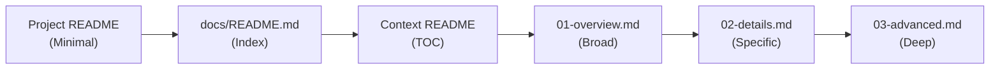
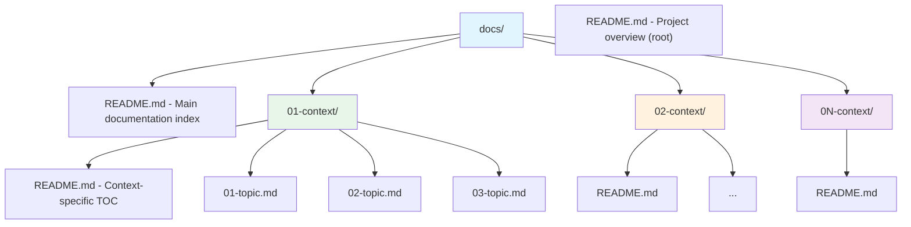
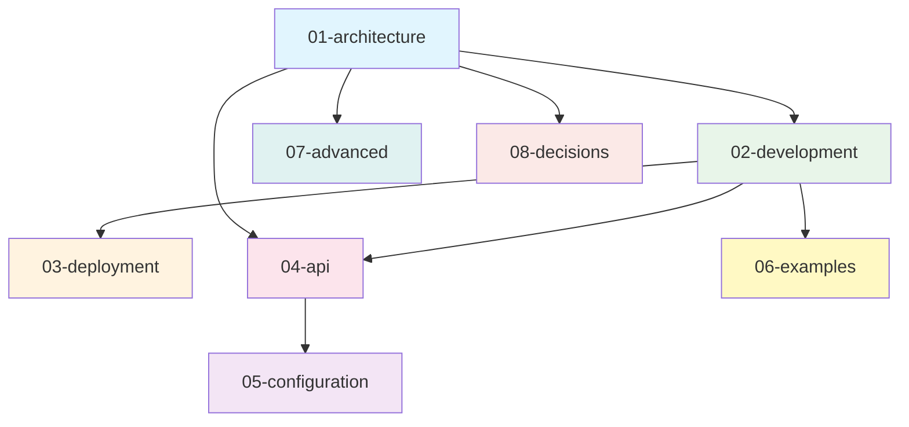
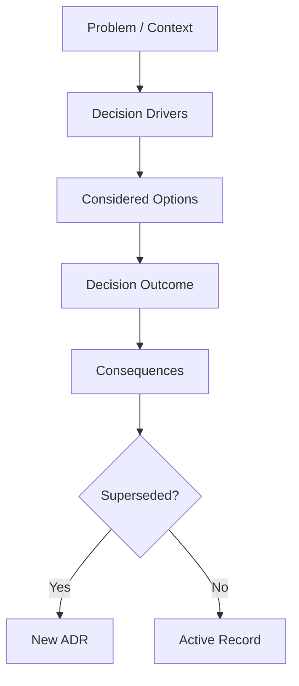
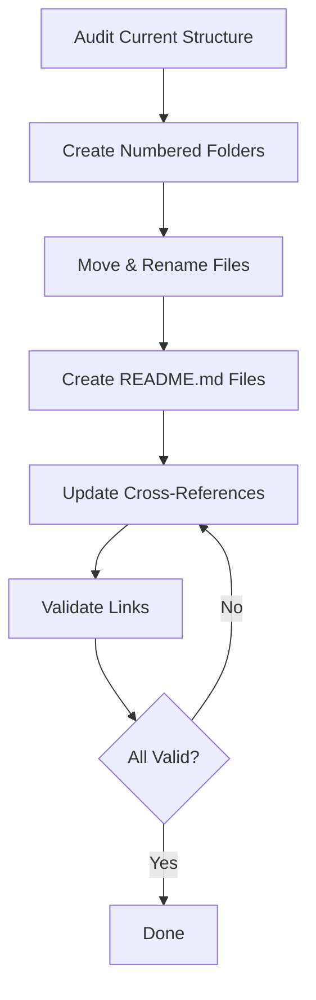

# Global Documentation Standards

> **Version**: 1.3.0
> **Last Updated**: 2026-02-03
> **Applies To**: All projects using Claude Code

## Overview

This document defines the standardized structure and conventions for project documentation across all projects. Following these standards ensures consistency, maintainability, and ease of navigation.

## Core Principles

1. **Context-Based Organization** - Group related content by major aspects
2. **Numbered Priority** - Folders and files numbered by importance/reading order
3. **Progressive Detail** - Overview to Specifics within each context
4. **Single Source of Truth** - All docs in `docs/` directory
5. **Self-Documenting** - Each context folder has README.md with TOC

### Progressive Detail Flow



## Directory Structure

### Required Organization



### Standard Contexts

Common context folders (adjust priority numbering based on project):

| Folder | Purpose | Typical Contents |
|--------|---------|------------------|
| `01-architecture/` | System design and patterns | overview, patterns, data-layer, components |
| `02-development/` | Developer guides | getting-started, workflows, testing, debugging |
| `03-deployment/` | Deployment and operations | environments, production, monitoring |
| `04-api/` | API documentation | authentication, endpoints, webhooks |
| `05-configuration/` | Configuration reference | env-vars, config-files, feature-flags |
| `06-examples/` | Practical examples | real-world, use-cases, recipes |
| `07-advanced/` | Advanced topics | optimization, scaling, custom-extensions |
| `08-decisions/` | Architecture Decision Records | ADRs documenting key technical decisions |

### Context Relationships



### Folder Numbering Rules

| Range | Priority | Description |
|-------|----------|-------------|
| 01-XX | Highest | Most important / frequently accessed content |
| 02-XX | High | Essential for getting started |
| 03-XX | Medium | Operational / deployment information |
| 04-XX+ | Reference | Supplementary / reference material |

> **Note**: Use sequential numbering (01, 02, 03) not gap numbering (01, 05, 10) - this allows insertion of new folders between existing ones.

## File Naming Conventions

### Format: `{number}-{description}.md`

**Rules**:

- **Prefix**: Two-digit number (01-, 02-, 03-)
- **Separator**: Single hyphen
- **Description**: kebab-case (lowercase, hyphens)
- **Extension**: Always `.md`

**Examples**:

| Example | Valid | Reason |
|---------|-------|--------|
| `01-overview.md` | Yes | Correct format |
| `02-getting-started.md` | Yes | Correct format |
| `03-authentication.md` | Yes | Correct format |
| `04-custom-generators.md` | Yes | Correct format |
| `overview.md` | No | Missing number prefix |
| `1-overview.md` | No | Single-digit prefix |
| `01_overview.md` | No | Underscore separator |
| `01-Overview.md` | No | Capitalized |
| `01-gettingStarted.md` | No | camelCase |

### Special Files

- `README.md` - Required in root and each context folder
- No numbering for README.md files

## README.md Requirements

### Root README.md

Project overview with:

- **Badges** - Required badges per [Badge Requirements](#badge-requirements) below
- **Description** - One-paragraph overview
- **Features** - Key capabilities (bullet points)
- **Installation** - Quick install command
- **Quick Start** - Minimal example
- **Documentation Links** - Links to `docs/README.md` and key sections
- **Contributing/License** - Standard sections

**Keep root README minimal** - detailed docs go in `docs/`

#### Badge Requirements

Every root `README.md` **must** include badges immediately after the H1 title,
on a single line (or consecutive lines), using `flat-square` style from shields.io.
Each badge image **must** link to its relevant page (registry, actions, license file).

##### Tier 1 -- Mandatory (All Projects)

| Badge | Purpose | shields.io Pattern |
|-------|---------|-------------------|
| **Latest Version** | Current release | `github/v/release/{owner}/{repo}` |
| **License** | License type | `github/license/{owner}/{repo}` |
| **CI/Build Status** | Build health | `github/actions/workflow/status/{owner}/{repo}/{workflow}.yml` |

##### Tier 2 -- Mandatory (Packages Only, by Registry)

If the project is published to a package registry, add the registry-specific version and download badges:

| Registry | Version Badge | Downloads Badge |
|----------|--------------|-----------------|
| **Packagist** (PHP/Composer) | `packagist/v/{vendor}/{package}` | `packagist/dm/{vendor}/{package}` |
| **npm** (Node.js) | `npm/v/{package}` | `npm/dm/{package}` |
| **PyPI** (Python) | `pypi/v/{package}` | `pypi/dm/{package}` |
| **RubyGems** (Ruby) | `gem/v/{gem}` | `gem/dt/{gem}` |
| **crates.io** (Rust) | `crates/v/{crate}` | `crates/d/{crate}` |
| **NuGet** (.NET) | `nuget/v/{package}` | `nuget/dt/{package}` |
| **Maven Central** (Java) | `maven-central/v/{groupId}/{artifactId}` | -- |
| **Go Modules** (Go) | `github/v/release/{owner}/{repo}` | -- |
| **Pub.dev** (Dart/Flutter) | `pub/v/{package}` | -- |
| **Hex.pm** (Elixir) | `hexpm/v/{package}` | `hexpm/dt/{package}` |

##### Tier 3 -- Recommended (Optional)

| Badge | Purpose | shields.io Pattern |
|-------|---------|-------------------|
| **Code Coverage** | Test quality | `codecov/c/github/{owner}/{repo}` |
| **PHP Version** | Compatibility | `packagist/dependency-v/{vendor}/{package}/php` |
| **Node Version** | Compatibility | `node/v/{package}` |
| **Python Version** | Compatibility | `pypi/pyversions/{package}` |
| **Go Version** | Compatibility | `github/go-mod/go-version/{owner}/{repo}` |
| **Rust MSRV** | Compatibility | `crates/msrv/{crate}` |

##### Badge Placement Rules

1. Badges appear **immediately after the H1 title**, before any description text
2. Use one badge per line or all badges on a single line separated by spaces
3. All badges use `?style=flat-square` query parameter
4. Every badge image **must** be wrapped in a link to the relevant page
5. Tier 1 badges come first, then Tier 2 (registry), then Tier 3 (optional)

##### Generic Badge Template

```markdown
[](https://github.com/{owner}/{repo}/releases)
[](LICENSE)
[](https://github.com/{owner}/{repo}/actions)
```

##### Registry-Specific Badge Reference

| Registry | Version Template | Downloads Template |
|----------|-----------------|-------------------|
| Packagist | `packagist/v/{vendor}/{package}` | `packagist/dt/{vendor}/{package}` |
| npm | `npm/v/{package}` | `npm/dm/{package}` |
| PyPI | `pypi/v/{package}` | `pypi/dm/{package}` |
| RubyGems | `gem/v/{gem}` | `gem/dt/{gem}` |
| crates.io | `crates/v/{crate}` | `crates/d/{crate}` |
| NuGet | `nuget/v/{package}` | `nuget/dt/{package}` |
| Maven Central | `maven-central/v/{groupId}/{artifactId}` | -- |
| Go Modules | `github/v/release/{owner}/{repo}` | -- |
| Pub.dev | `pub/v/{package}` | -- |
| Hex.pm | `hexpm/v/{package}` | `hexpm/dt/{package}` |

##### Project Type Badge Matrix

| Badge | PHP Pkg | npm Pkg | PyPI Pkg | Ruby Gem | Rust Crate | .NET Pkg | Java Pkg | Go Mod | Dart Pkg | Elixir Pkg | API | CLI | Full-Stack |
|-------|:-------:|:-------:|:--------:|:--------:|:----------:|:--------:|:--------:|:------:|:--------:|:----------:|:---:|:---:|:----------:|
| Version | Yes | Yes | Yes | Yes | Yes | Yes | Yes | Yes | Yes | Yes | Yes | Yes | Yes |
| License | Yes | Yes | Yes | Yes | Yes | Yes | Yes | Yes | Yes | Yes | Yes | Yes | Yes |
| CI Status | Yes | Yes | Yes | Yes | Yes | Yes | Yes | Yes | Yes | Yes | Yes | Yes | Yes |
| Registry Downloads | Yes | Yes | Yes | Yes | Yes | Yes | -- | -- | -- | Yes | -- | -- | -- |
| Coverage | Rec | Rec | Rec | Rec | Rec | Rec | Rec | Rec | Rec | Rec | Rec | Rec | Rec |
| Lang Version | Rec | Rec | Rec | -- | Rec | -- | -- | Rec | -- | -- | -- | -- | -- |

> **Note**: "Yes" = mandatory, "Rec" = recommended, "--" = not applicable.

### docs/README.md

Main documentation index with:

- **Title** - "Documentation"
- **Overview** - Brief intro to documentation structure
- **Navigation** - Links to all context folders with descriptions
- **Getting Started** - Link to quickstart guide
- **Search Tips** - How to find information

**Template**:

```markdown
# Documentation

## Overview
[Brief description of the project and documentation organization]

## Documentation Structure

### [01. Architecture](01-architecture/README.md)
System design, patterns, and architectural decisions.

### [02. Development](02-development/README.md)
Developer guides, workflows, and best practices.

### [03. Deployment](03-deployment/README.md)
Deployment procedures and operational guides.

## Quick Start
New to the project? Start with [Getting Started](02-development/01-getting-started.md).

## Finding Information
- **Concepts**: Check Architecture section
- **How-to**: Check Development section
- **API Reference**: Check API section
```

### Context Folder README.md

Table of contents for context with:

- **Context Title**
- **Overview** - What this section covers
- **Table of Contents** - All files in order with descriptions
- **Related Sections** - Links to related context folders

**Template**:

```markdown
# {Context Name}

## Overview
[Brief description of this context and what it covers]

## Table of Contents

### [1. {Topic}](01-{topic}.md)
[Brief description of what this covers]

### [2. {Topic}](02-{topic}.md)
[Brief description of what this covers]

### [3. {Topic}](03-{topic}.md)
[Brief description of what this covers]

## Related Documentation
- [Related Context 1](../02-{context}/README.md)
- [Related Context 2](../03-{context}/README.md)
```

## Document Structure

### Standard Page Format

Every documentation page should follow this structure:

```markdown
# Title

[Brief introduction paragraph - what this page covers]

## Section 1

[Content with examples]

### Subsection 1.1

[Detailed content]

## Section 2

[More content]

## Examples

[Practical code examples from the project]

## Next Steps

- [Related Topic 1](02-related-topic.md)
- [Related Topic 2](../03-deployment/01-overview.md)
```

### Heading Hierarchy

| Level | Syntax | Usage | Limit |
|-------|--------|-------|-------|
| H1 | `#` | Page title only | One per page |
| H2 | `##` | Main sections | Unlimited |
| H3 | `###` | Subsections | Unlimited |
| H4 | `####` | Deep nesting | Use sparingly |

### Content Guidelines

1. **Introduction Paragraph**: Every page starts with brief overview
2. **Progressive Detail**: Simple to Complex within each page
3. **Code Examples**: Include actual code from the project
4. **Cross-References**: Link to related pages at bottom
5. **Active Voice**: Use direct, active language
6. **Short Paragraphs**: 2-4 sentences maximum

## Frontmatter (Optional)

Documentation pages may include YAML frontmatter for richer tooling and metadata tracking:

```markdown
---
title: Getting Started
description: How to install and configure the project
last_updated: 2025-12-10
tags: [installation, setup, quickstart]
---

# Getting Started
...
```

| Field | Required | Purpose |
|-------|----------|---------|
| `title` | No | Display title (defaults to H1) |
| `description` | No | Brief summary for index generation |
| `last_updated` | No | Track freshness |
| `tags` | No | Enable search and cross-referencing |

## Markdown Conventions

### Code Blocks

Always specify language:

```markdown
```php
class Example
{
    // Code here
}
```
```

### Inline Code

Use for:
- Variable names: `$variable`
- Class names: `TokenGenerator`
- File paths: `config/app.php`
- Commands: `php artisan migrate`

### Emphasis

- **Bold** for UI elements, file names, important terms
- *Italic* sparingly for emphasis
- `Code` for technical terms, values

### Lists

**Ordered** for steps/sequences:
```markdown
1. First step
2. Second step
3. Third step
```

**Unordered** for options/features:

```markdown
- Feature one
- Feature two
- Feature three
```

### Tables

For comparisons and reference:

```markdown
| Feature | Description | Example |
|---------|-------------|---------|
| Item 1  | Details     | `code`  |
| Item 2  | Details     | `code`  |
```

### Blockquotes

For warnings, notes, tips:

```markdown
> **Note**: Important information here

> **Warning**: Critical warning here

> **Tip**: Helpful tip here
```

## Cross-Referencing

### Internal Links

Use **relative paths** from current location:

```markdown
<!-- Same folder -->
[Related Topic](02-related-topic.md)

<!-- Parent folder -->
[Main Index](../README.md)

<!-- Different context -->
[Deployment Guide](../03-deployment/01-overview.md)

<!-- Section within same page -->
[Jump to Examples](#examples)
```

### External Links

Full URLs for external resources:

```markdown
[Laravel Documentation](https://laravel.com/docs)
[GitHub Repository](https://github.com/user/repo)
```

## Code Examples

### Include Context

Always show full context, not just fragments:

```markdown
<!-- Good -->
```php
use App\Models\User;

class UserController extends Controller
{
    public function index()
    {
        return User::all();
    }
}
```

<!-- Bad -->
```php
return User::all();
```
```

### Comment Explanations

Add comments to explain non-obvious code:

```php
class Post extends Model
{
    use InteractsWithSlug;

    // Generate slug from 'title' instead of default 'name'
    protected $slug_source_column = 'title';
}
```

### Show Real Examples

Use actual code from the project when possible:

```markdown
<!-- Reference actual files -->
See [src/Generators/TokenGenerator.php](../src/Generators/TokenGenerator.php:15-30)

<!-- Include real config -->
```php
// config/app.php
'timezone' => env('APP_TIMEZONE', 'UTC'),
```
```

## Architecture Decision Records (ADR)

### Purpose

Record significant architectural decisions with context and consequences. Use the `08-decisions/` context folder.

### ADR Template

```markdown
# ADR-{number}: {Title}

## Status
{Proposed | Accepted | Deprecated | Superseded}

## Context
[What is the issue that we're seeing that is motivating this decision?]

## Decision
[What is the change that we're proposing and/or doing?]

## Consequences
[What becomes easier or more difficult to do because of this change?]
```

### ADR Decision Flow



## Linting and Quality Assurance

### Markdown Linting

This documentation standard includes automated linting using **markdownlint** to ensure consistency and catch common formatting issues.

#### Installation

Markdownlint is automatically installed during setup:

```bash
npm install -g markdownlint-cli
```

#### Configuration

Linting rules are defined in `~/.claude/.markdownlintrc`:

| Rule | Setting | Purpose |
|------|---------|---------|
| MD003 | `style: atx` | ATX-style headers (`#` syntax) |
| MD004 | `style: dash` | Dash-style unordered lists (`-`) |
| MD007 | `indent: 2` | 2-space indentation for lists |
| MD013 | `line_length: 120` | 120 character line length (excludes code blocks and tables) |
| MD024 | `siblings_only` | Allow duplicate headers in different sections |
| MD025 | enabled | Single H1 per document |
| MD033 | allowed HTML | Allow specific HTML elements (br, details, summary, kbd, sub, sup) |
| MD040 | enabled | Language identifiers required in fenced code blocks |
| MD041 | enabled | First line must be top-level header |
| MD046 | `style: fenced` | Fenced code block style (backticks) |
| MD048 | `style: backtick` | Code fence style (backticks, not tildes) |

#### Running the Linter

Use the included `lint.sh` script to lint all files in one pass:

| Action | Command |
|--------|---------|
| Lint all docs | `~/.claude/lint.sh` |
| Lint & auto-fix all docs | `~/.claude/lint.sh --fix` |
| Lint specific directory | `~/.claude/lint.sh src/` |
| Lint & auto-fix specific dir | `~/.claude/lint.sh --fix src/` |
| Lint current directory | `~/.claude/lint.sh .` |

Or run `markdownlint` directly for single files:

| Action | Command |
|--------|---------|
| Lint specific file | `markdownlint docs/01-architecture/01-overview.md` |
| Use custom config | `markdownlint --config ~/.claude/.markdownlintrc docs/**/*.md` |

#### Common Linting Issues

| Issue | Rule | Solution |
|-------|------|----------|
| Missing language in code block | MD040 | Add language identifier: ` ```php ` |
| Multiple H1 headers | MD025 | Use only one `#` title per file |
| Inconsistent list markers | MD004 | Use `-` for all unordered lists |
| Trailing spaces | MD009 | Remove spaces at end of lines |
| Long lines | MD013 | Break lines at 120 characters (prose only) |
| No blank lines around headers | MD022 | Add blank line before and after headers |

#### Pre-commit Hook (Optional)

Add to `.git/hooks/pre-commit` to lint before commits:

```bash
#!/bin/bash
# Lint staged markdown files
STAGED_MD=$(git diff --cached --name-only --diff-filter=ACM | grep '\.md$')

if [ -n "$STAGED_MD" ]; then
    echo "Linting markdown files..."
    markdownlint $STAGED_MD

    if [ $? -ne 0 ]; then
        echo "Markdown linting failed. Fix issues or use --no-verify to skip."
        exit 1
    fi
    echo "Markdown linting passed!"
fi
```

Make executable:

```bash
chmod +x .git/hooks/pre-commit
```

#### IDE Integration

| Editor | Plugin |
|--------|--------|
| VS Code | [markdownlint extension](https://marketplace.visualstudio.com/items?itemName=DavidAnson.vscode-markdownlint) |
| Vim/Neovim | ALE or similar linter plugin |
| JetBrains IDEs | Markdown Navigator plugin |

### Quality Checklist with Linting

Updated checklist including linting:

#### Before Committing Documentation

- [ ] Run `markdownlint docs/**/*.md`
- [ ] Fix all linting errors
- [ ] Verify all code blocks have language identifiers
- [ ] Check line lengths (prose should be readable)
- [ ] Ensure consistent list formatting
- [ ] Validate internal links still work

#### CI/CD Integration

Add to your CI pipeline (e.g., `.github/workflows/docs-lint.yml`):

```yaml
name: Lint Documentation

on: [push, pull_request]

jobs:
  markdown-lint:
    runs-on: ubuntu-latest
    steps:
      - uses: actions/checkout@v3
      - name: Setup Node.js
        uses: actions/setup-node@v3
        with:
          node-version: '18'
      - name: Install markdownlint
        run: npm install -g markdownlint-cli
      - name: Lint markdown files
        run: markdownlint 'docs/**/*.md'
```

## Migration Guide

### Converting Existing Docs



| Step | Action | Command / Detail |
|------|--------|------------------|
| 1 | Audit current structure | List all existing docs, identify context groupings, determine priority |
| 2 | Create numbered structure | `mkdir -p docs/{01-architecture,02-development,03-deployment}` |
| 3 | Move and rename files | `mv docs/architecture.md docs/01-architecture/01-overview.md` |
| 4 | Create README.md files | docs/README.md (main index) + each context folder README.md (TOC) |
| 5 | Update cross-references | Change absolute paths to relative, update for new numbered structure |
| 6 | Validate links | Test all internal links, ensure progressive flow |

## Checklist

Use this checklist when creating or auditing documentation:

### Structure

- [ ] All docs in `docs/` directory
- [ ] Context folders numbered (01-, 02-, 03-)
- [ ] Files numbered within contexts (01-, 02-, 03-)
- [ ] README.md in root
- [ ] README.md in docs/
- [ ] README.md in each context folder

### Naming

- [ ] All files use kebab-case
- [ ] Numbered prefixes on all content files
- [ ] No capitals in filenames
- [ ] Consistent naming patterns

### Content

- [ ] Each page has H1 title
- [ ] Introduction paragraph on each page
- [ ] Code examples included
- [ ] Cross-references at bottom
- [ ] Language specified in code blocks

### Navigation

- [ ] Table of contents in context READMEs
- [ ] Relative paths for internal links
- [ ] All links tested and working
- [ ] Progressive detail flow maintained

### Quality

- [ ] Consistent formatting
- [ ] Active voice used
- [ ] Short paragraphs (2-4 sentences)
- [ ] Practical examples from codebase
- [ ] No broken links

### Linting

- [ ] Run `markdownlint docs/**/*.md` passes
- [ ] All code blocks have language identifiers
- [ ] No trailing whitespace
- [ ] Consistent list marker style (dashes)
- [ ] Line length under 120 characters (prose)

### Badges

- [ ] Root README.md has Tier 1 badges (Version, License, CI)
- [ ] Badges appear immediately after H1 title
- [ ] All badges use `?style=flat-square`
- [ ] All badge images link to relevant pages
- [ ] Registry-specific badges included (if published package)
- [ ] Badge shields.io URLs use correct patterns

## Examples

### Example: Laravel Package Documentation

```mermaid
graph TD
    root["docs/"]
    root --> readme["README.md"]
    root --> gs["01-getting-started/"]
    root --> arch["02-architecture/"]
    root --> traits["03-traits/"]
    root --> gens["04-generators/"]
    root --> config["05-configuration/"]
    root --> examples["06-examples/"]
    root --> advanced["07-advanced/"]
    root --> decisions["08-decisions/"]

    gs --> gs_r["README.md"]
    gs --> gs_01["01-installation.md"]
    gs --> gs_02["02-quick-start.md"]
    gs --> gs_03["03-basic-usage.md"]

    arch --> arch_r["README.md"]
    arch --> arch_01["01-overview.md"]
    arch --> arch_02["02-generator-pattern.md"]
    arch --> arch_03["03-resolution-strategy.md"]

    traits --> traits_r["README.md"]
    traits --> traits_01["01-overview.md"]
    traits --> traits_02["02-interacts-with-uuid.md"]
    traits --> traits_03["03-interacts-with-token.md"]
    traits --> traits_04["04-interacts-with-slug.md"]

    gens --> gens_r["README.md"]
    gens --> gens_01["01-overview.md"]
    gens --> gens_02["02-token-generator.md"]
    gens --> gens_03["03-uuid-generator.md"]
    gens --> gens_04["04-slug-generator.md"]

    config --> config_r["README.md"]
    config --> config_01["01-config-file.md"]
    config --> config_02["02-environment-vars.md"]

    examples --> examples_r["README.md"]
    examples --> examples_01["01-real-world.md"]

    advanced --> advanced_r["README.md"]
    advanced --> advanced_01["01-custom-generators.md"]

    decisions --> decisions_r["README.md"]
    decisions --> decisions_01["01-adr-template.md"]

    style root fill:#e1f5fe
    style gs fill:#e8f5e9
    style arch fill:#fff3e0
    style traits fill:#fce4ec
    style gens fill:#f3e5f5
    style config fill:#fff9c4
    style examples fill:#e0f2f1
    style advanced fill:#fbe9e7
    style decisions fill:#e8eaf6
```



## Usage

### With Claude Code

| Command | Description |
|---------|-------------|
| `/docs` | Create new documentation structure |
| `/docs reorganize` | Reorganize existing docs following standards |
| `/docs validate` | Validate docs and report issues |
| `/docs update-toc` | Update all README.md TOCs |
| `/docs health` | Generate documentation health report |
| `/docs scaffold <type>` | Scaffold from template: `laravel`, `api`, `cli`, `sdk`, `fullstack` |

### Manual Reference

When manually creating documentation:

1. Reference this file for structure
2. Use the templates provided
3. Follow the checklist
4. Validate against standards

## Maintenance

### Updating These Guidelines

When updating this guideline:

1. Update version number at top
2. Update "Last Updated" date
3. Document changes in CHANGELOG section below
4. Notify team of changes

### CHANGELOG

**v1.3.0** (2026-02-03)

- Added mandatory Badge Requirements subsection with Tier 1/2/3 badge specifications
- Added badge placement rules and generic badge markdown template
- Added Registry-Specific Badge Reference table covering 10 package registries
- Added Project Type Badge Matrix for 13 project types
- Added Badges validation checklist section
- Updated Root README.md requirements to reference Badge Requirements
- Added badge templates for all major ecosystems in EXAMPLES.md
- Expanded project detection table with Python, Ruby, Rust, Go, .NET, Java, Dart, Elixir
- Added badge generation and validation steps to documentation workflow
- Added Badge Compliance metric to health report

**v1.2.0** (2026-02-03)

- Replaced all ASCII tree diagrams with MermaidJS diagrams
- Converted structured data lists to markdown table syntax
- Added Progressive Detail Flow diagram
- Added Context Relationships diagram
- Added Project Detection table for auto-detection
- Added Frontmatter/Metadata support section
- Added Architecture Decision Records (ADR) section with template and flow diagram
- Added `08-decisions/` to Standard Contexts
- Added Health Report task mode
- Added Scaffold task mode with project type templates
- Added explicit command reference table
- Converted Linting Configuration to table format
- Converted IDE Integration to table format
- Converted Migration Guide steps to table with flowchart
- Converted File Naming examples to validity table
- Converted Heading Hierarchy to table format
- Converted Folder Numbering Rules to table format

**v1.1.0** (2025-12-10)

- Added markdown linting support with markdownlint
- Added `.markdownlintrc` configuration file
- Added linting section with setup and usage instructions
- Added pre-commit hook example
- Added CI/CD integration example
- Updated quality checklist with linting items

**v1.0.0** (2024-12-10)

- Initial global documentation standards
- Numbered folder structure
- Context-based organization
- Progressive detail flow
- Comprehensive templates and examples

---

**Questions?** These guidelines are living documents. Suggest improvements or clarifications as needed.
