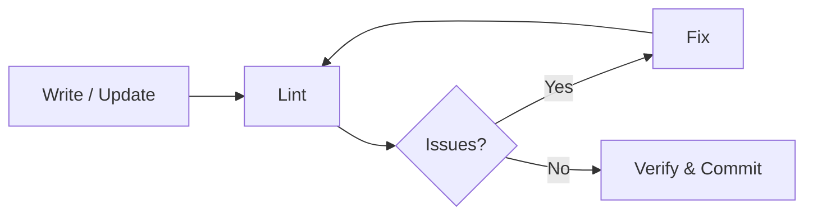
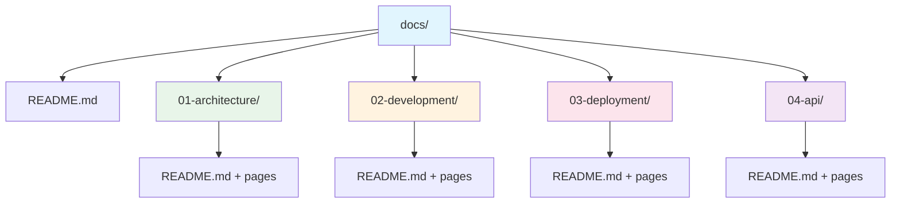

# Commands

All available `/docs` commands in Claude Code.

## Command Reference

| Command                              | Description                                                         |
|--------------------------------------|---------------------------------------------------------------------|
| `/docs`                              | Create new documentation structure (auto-detects project type)      |
| `/docs reorganize`                   | Reorganize existing docs into numbered standard                     |
| `/docs validate`                     | Validate against standards and report issues                        |
| `/docs update-toc`                   | Update all README.md TOCs                                           |
| `/docs health`                       | Generate documentation health report                                |
| `/docs scaffold <type>`              | Scaffold from template: `laravel`, `api`, `cli`, `sdk`, `fullstack` |
| `/docs release-note`                 | Generate full release note from today's git log                     |
| `/docs release-note --tldr`          | Generate TLDR release note                                          |
| `/docs release-note --since <date>`  | Release note from a specific date range                             |

## Task Modes

| Mode          | Purpose                                          | Trigger                         |
|---------------|--------------------------------------------------|---------------------------------|
| Create        | Generate complete documentation structure        | New project / no docs           |
| Reorganize    | Convert existing docs to standards               | Existing unstructured docs      |
| Update TOCs   | Regenerate README.md files                       | After adding/removing pages     |
| Validate      | Check docs against standards + lint              | Before commits / CI             |
| Health Report | Quantitative documentation quality assessment    | On demand                       |
| Scaffold      | Generate structure from project type template    | Quick setup                     |
| Release Note  | Generate release notes from git log              | Before release / end of day     |

## Documentation Workflow

## Standard Structure

### Key Principles

1. **Context-Based Organization** - Group by major aspects
2. **Numbered Priority** - Folders and files numbered by importance (`01-`, `02-`)
3. **Progressive Detail** - Start with overview, drill into specifics
4. **Single Source of Truth** - All docs in `docs/` directory
5. **Self-Documenting** - Each folder has `README.md` with TOC
