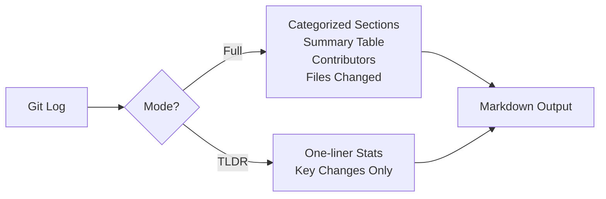

# Release Notes

Generate release notes from the current repo's git log using `release-note.sh`.

## Quick Reference

| Action | Command |
|--------|---------|
| Full release note (today) | `~/.claude/release-note.sh` |
| TLDR version (today) | `~/.claude/release-note.sh --tldr` |
| Since yesterday | `~/.claude/release-note.sh --since yesterday` |
| Since specific date | `~/.claude/release-note.sh --since "2025-12-01"` |
| Since last week | `~/.claude/release-note.sh --since "1 week ago"` |
| Write to custom file | `~/.claude/release-note.sh --output RELEASE.md` |
| Append to CHANGELOG.md | `~/.claude/release-note.sh --write` |
| Write + TLDR | `~/.claude/release-note.sh --tldr --write` |

## Modes



### Full Mode

Generates a comprehensive release note with:

| Section | Content |
|---------|---------|
| Summary | Commit count, files changed, contributors table |
| New Features | Commits matching `feat`, `add`, `new` prefixes |
| Bug Fixes | Commits matching `fix`, `bug`, `patch` prefixes |
| Documentation | Commits matching `docs` prefix |
| Refactoring | Commits matching `refactor`, `clean`, `improve` prefixes |
| Maintenance | Commits matching `chore`, `build`, `ci`, `deps` prefixes |
| Other Changes | All remaining commits |
| Contributors | List of authors |
| Files Changed | Top 20 most-changed files with frequency |

### TLDR Mode

Short summary with commit stats and key changes only.

## Writing to CHANGELOG.md

Use `--write` to append entries to `CHANGELOG.md` in
[Keep a Changelog](https://keepachangelog.com/en/1.1.0/) format:

```bash
~/.claude/release-note.sh --write --since "1 week ago"
```

Behavior:

- Without `--write` — prints to stdout only, no file is created or modified
- With `--write` + no `CHANGELOG.md` — creates the file with template and entries
- With `--write` + existing `CHANGELOG.md` — inserts new entries under
  `## [Unreleased]` without overwriting existing content

### Commit Category Mapping

| Commit prefix | Changelog section |
|---|---|
| `feat`, `add`, `new` | `### Added` |
| `fix`, `bug`, `patch` | `### Fixed` |
| `docs`, `refactor`, `chore`, other | `### Changed` |

## Via Slash Command

You can also use the `/docs` command:

```text
/docs release-note
/docs release-note --tldr
/docs release-note --since "1 week ago"
```
