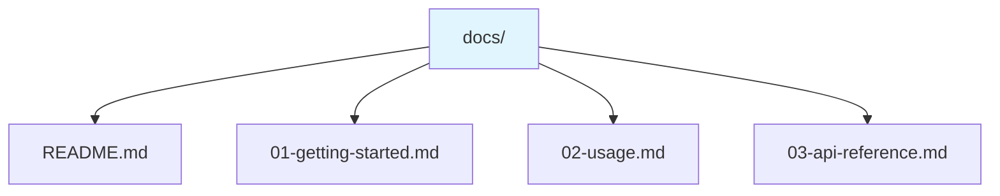

# Documentation Structure Examples

This document provides real-world examples of documentation structures using the Claude Code Documentation Standards.

## Example 1: Laravel Package

Perfect for Laravel packages and libraries.

```mermaid
graph TD
    root["docs/"]
    root --> readme["README.md - Main index"]
    root --> gs["01-getting-started/"]
    root --> feat["02-features/"]
    root --> adv["03-advanced/"]
    root --> api["04-api-reference/"]
    root --> decisions["08-decisions/"]

    gs --> gs_r["README.md"]
    gs --> gs_01["01-installation.md"]
    gs --> gs_02["02-quick-start.md"]
    gs --> gs_03["03-configuration.md"]

    feat --> feat_r["README.md"]
    feat --> feat_01["01-overview.md"]
    feat --> feat_02["02-trait-uuid.md"]
    feat --> feat_03["03-trait-token.md"]
    feat --> feat_04["04-trait-slug.md"]

    adv --> adv_r["README.md"]
    adv --> adv_01["01-custom-generators.md"]
    adv --> adv_02["02-extending.md"]

    api --> api_r["README.md"]
    api --> api_01["01-classes.md"]
    api --> api_02["02-methods.md"]

    decisions --> dec_r["README.md"]
    decisions --> dec_01["01-adr-template.md"]

    project["README.md - Project overview"]

    style root fill:#e1f5fe
    style gs fill:#e8f5e9
    style feat fill:#fff3e0
    style adv fill:#fce4ec
    style api fill:#f3e5f5
    style decisions fill:#e8eaf6
```



## Example 2: REST API Documentation

Ideal for API services and microservices.

```mermaid
graph TD
    root["docs/"]
    root --> readme["README.md - Main index"]
    root --> gs["01-getting-started/"]
    root --> ep["02-endpoints/"]
    root --> guides["03-guides/"]
    root --> ref["04-reference/"]

    gs --> gs_r["README.md"]
    gs --> gs_01["01-introduction.md"]
    gs --> gs_02["02-authentication.md"]
    gs --> gs_03["03-first-request.md"]

    ep --> ep_r["README.md"]
    ep --> ep_01["01-users.md"]
    ep --> ep_02["02-posts.md"]
    ep --> ep_03["03-comments.md"]
    ep --> ep_04["04-media.md"]

    guides --> guides_r["README.md"]
    guides --> guides_01["01-pagination.md"]
    guides --> guides_02["02-filtering.md"]
    guides --> guides_03["03-rate-limiting.md"]
    guides --> guides_04["04-webhooks.md"]

    ref --> ref_r["README.md"]
    ref --> ref_01["01-errors.md"]
    ref --> ref_02["02-status-codes.md"]
    ref --> ref_03["03-changelog.md"]

    project["README.md - Project overview"]

    style root fill:#e1f5fe
    style gs fill:#e8f5e9
    style ep fill:#fff3e0
    style guides fill:#fce4ec
    style ref fill:#f3e5f5
```



## Example 3: Full-Stack Application

Comprehensive documentation for complex applications.

```mermaid
graph TD
    root["docs/"]
    root --> readme["README.md - Main index"]
    root --> arch["01-architecture/"]
    root --> dev["02-development/"]
    root --> deploy["03-deployment/"]
    root --> feat["04-features/"]
    root --> trouble["05-troubleshooting/"]

    arch --> arch_r["README.md"]
    arch --> arch_01["01-overview.md"]
    arch --> arch_02["02-frontend.md"]
    arch --> arch_03["03-backend.md"]
    arch --> arch_04["04-database.md"]

    dev --> dev_r["README.md"]
    dev --> dev_01["01-getting-started.md"]
    dev --> dev_02["02-coding-standards.md"]
    dev --> dev_03["03-git-workflow.md"]
    dev --> dev_04["04-testing.md"]

    deploy --> deploy_r["README.md"]
    deploy --> deploy_01["01-environments.md"]
    deploy --> deploy_02["02-docker.md"]
    deploy --> deploy_03["03-ci-cd.md"]
    deploy --> deploy_04["04-monitoring.md"]

    feat --> feat_r["README.md"]
    feat --> feat_01["01-authentication.md"]
    feat --> feat_02["02-user-management.md"]
    feat --> feat_03["03-notifications.md"]
    feat --> feat_04["04-payments.md"]

    trouble --> trouble_r["README.md"]
    trouble --> trouble_01["01-common-issues.md"]
    trouble --> trouble_02["02-debugging.md"]
    trouble --> trouble_03["03-faq.md"]

    project["README.md - Project overview"]

    style root fill:#e1f5fe
    style arch fill:#e8f5e9
    style dev fill:#fff3e0
    style deploy fill:#fce4ec
    style feat fill:#f3e5f5
    style trouble fill:#fff9c4
```



## Example 4: CLI Tool

Documentation for command-line tools.

```mermaid
graph TD
    root["docs/"]
    root --> readme["README.md - Main index"]
    root --> install["01-installation/"]
    root --> usage["02-usage/"]
    root --> cmds["03-commands/"]
    root --> ref["04-reference/"]

    install --> install_r["README.md"]
    install --> install_01["01-requirements.md"]
    install --> install_02["02-install.md"]
    install --> install_03["03-configuration.md"]

    usage --> usage_r["README.md"]
    usage --> usage_01["01-basic-commands.md"]
    usage --> usage_02["02-advanced-usage.md"]
    usage --> usage_03["03-examples.md"]

    cmds --> cmds_r["README.md"]
    cmds --> cmds_01["01-init.md"]
    cmds --> cmds_02["02-build.md"]
    cmds --> cmds_03["03-deploy.md"]
    cmds --> cmds_04["04-config.md"]

    ref --> ref_r["README.md"]
    ref --> ref_01["01-flags.md"]
    ref --> ref_02["02-environment.md"]
    ref --> ref_03["03-config-file.md"]

    project["README.md - Project overview"]

    style root fill:#e1f5fe
    style install fill:#e8f5e9
    style usage fill:#fff3e0
    style cmds fill:#fce4ec
    style ref fill:#f3e5f5
```



## Example 5: Library/SDK

Documentation for SDKs and libraries.

```mermaid
graph TD
    root["docs/"]
    root --> readme["README.md - Main index"]
    root --> intro["01-introduction/"]
    root --> guides["02-guides/"]
    root --> api["03-api-reference/"]
    root --> adv["04-advanced/"]

    intro --> intro_r["README.md"]
    intro --> intro_01["01-overview.md"]
    intro --> intro_02["02-installation.md"]
    intro --> intro_03["03-quick-start.md"]

    guides --> guides_r["README.md"]
    guides --> guides_01["01-authentication.md"]
    guides --> guides_02["02-making-requests.md"]
    guides --> guides_03["03-handling-responses.md"]
    guides --> guides_04["04-error-handling.md"]

    api --> api_r["README.md"]
    api --> api_01["01-client.md"]
    api --> api_02["02-resources.md"]
    api --> api_03["03-models.md"]
    api --> api_04["04-exceptions.md"]

    adv --> adv_r["README.md"]
    adv --> adv_01["01-customization.md"]
    adv --> adv_02["02-plugins.md"]
    adv --> adv_03["03-testing.md"]

    project["README.md - Project overview"]

    style root fill:#e1f5fe
    style intro fill:#e8f5e9
    style guides fill:#fff3e0
    style api fill:#fce4ec
    style adv fill:#f3e5f5
```



## Common Patterns

### Root README.md Structure

```markdown
# Project Name

Brief description of what this project does.

## Features

- Feature 1
- Feature 2
- Feature 3

## Installation

\`\`\`bash
npm install project-name
\`\`\`

## Quick Start

\`\`\`javascript
// Minimal working example
\`\`\`

## Documentation

Full documentation is available in the [docs/](docs/) directory:

- [Getting Started](docs/01-getting-started/README.md)
- [API Reference](docs/02-api-reference/README.md)
- [Advanced Usage](docs/03-advanced/README.md)

## Contributing

See [CONTRIBUTING.md](CONTRIBUTING.md)

## License

MIT
```

### Context README.md Structure

```markdown
# Getting Started

This section covers everything you need to get up and running.

## Table of Contents

### [1. Installation](01-installation.md)

How to install and set up the project.

### [2. Quick Start](02-quick-start.md)

Get running in 5 minutes with a simple example.

### [3. Configuration](03-configuration.md)

Configure the project for your needs.

## Related Documentation

- [API Reference](../02-api-reference/README.md)
- [Advanced Topics](../03-advanced/README.md)
```

### Individual Page Structure

```markdown
# Topic Title

Brief introduction to what this page covers and why it's important.

## Section 1

Main content with explanations.

### Subsection 1.1

Detailed information.

## Examples

\`\`\`language
// Code example
\`\`\`

## Common Issues

Troubleshooting tips if applicable.

## Next Steps

- [Related Topic](02-related.md)
- [Advanced Usage](../03-advanced/01-overview.md)
```

## Tips for Choosing Structure

| Project Size | Doc Count | Recommended Structure |
|-------------|-----------|----------------------|
| Small | < 10 docs | Flat structure with numbered files directly in `docs/` |
| Medium | 10-30 docs | 3-4 context folders |
| Large | 30+ docs | 5-7+ context folders with clear separation |

### Small Project Structure



### Medium Project Contexts

| Context | Purpose |
|---------|---------|
| `01-getting-started/` | Installation, setup, quickstart |
| `02-guides/` | How-to guides and tutorials |
| `03-api-reference/` | Technical reference documentation |

### Large Project Contexts

| Context | Purpose |
|---------|---------|
| `01-introduction/` | Overview and onboarding |
| `02-architecture/` | System design and decisions |
| `03-development/` | Developer workflows and standards |
| `04-deployment/` | Operations and infrastructure |
| `05-api-reference/` | Technical API documentation |
| `06-examples/` | Real-world usage examples |
| `07-advanced/` | Deep-dive topics and optimization |

## Customizing for Your Project

1. **Identify contexts** - What are the major aspects? (Getting started, API, deployment, etc.)
2. **Prioritize** - Number folders by importance and reading order
3. **Group logically** - Keep related content together
4. **Start simple** - Begin with 2-3 contexts, expand as needed
5. **Stay consistent** - Follow the same pattern throughout

## Need Help?

- See [docs-guidelines.md](../docs-guidelines.md) for full standards
- Use `/docs` command in Claude Code for automatic structure generation
- Check existing projects for inspiration
